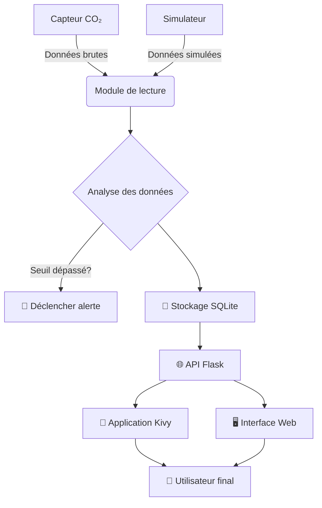

# 🌬️ **Aerium — Surveillance intelligente du CO₂**


[](LICENSE)

   

> Projet de **monitoring de la qualité de l'air** combinant
> **capteur CO₂, application Python et WebApp interactive**

**Aerium** est un projet développé dans le cadre de la **spécialité NSI**, visant à concevoir un système complet de surveillance du **CO₂ (ppm)**, indicateur clé de la qualité de l'air intérieur.

Le projet propose :
* une **application Python** (Kivy) pour le suivi local,
* une **WebApp Flask** pour la visualisation à distance,
* un **système d'alertes**, d'analyses et d'historique.

👉 Conçu pour des usages concrets : **salle de classe, chambre, bureau, atelier**. Fonctionne **avec ou sans capteur physique**.

---

## 🏁 Démarrage Rapide (Mode Simulation)

1.  **Installez** le projet (voir section [🚀 Installation](#🚀-installation)).
2.  **Lancez le serveur Web** :
    ```bash
    cd site
    python app.py
    ```
3.  **Ouvrez** `http://localhost:5000` dans votre navigateur.

Vous visualisez dès maintenant des **données simulées**. Pour utiliser un capteur réel, consultez la section [🔌 Configuration Matérielle](#🔌-configuration-matérielle-capteur-physique).

---

## 📸 Aperçu


*Interface Web - Tableau de bord avec graphique temps réel*


*Application Python (Kivy) - Vue mobile/desktop*

---

## 🎯 Objectifs du projet (NSI)

* Mesurer une grandeur physique réelle (CO₂)
* Exploiter des **données en temps réel**
* Concevoir une **architecture logicielle complète**
* Mettre en œuvre :
  * des **structures de données**
  * des **algorithmes d'analyse**
  * une **interface utilisateur**
* Relier **matériel, logiciel et visualisation**

---

## ✨ Fonctionnalités principales

### 🌬️ Mesure du CO₂ en temps réel
* Lecture continue depuis un capteur physique (MH-Z19B, SCD30…) ou simulateur
* Valeurs exprimées en **ppm**
* Fréquence de mise à jour configurable

### 🚦 Indicateur de qualité de l'air

| CO₂ (ppm)  | Qualité            | Recommandation       |
| ---------- | ------------------ | -------------------- |
| < 800      | 🟢 Excellent       | Air pur              |
| 800 – 1200 | 🟡 Moyen           | Ventilation conseillée |
| > 1200     | 🔴 Mauvais         | **AÉRER IMMÉDIATEMENT** |

Les seuils sont **modifiables par l'utilisateur**.

### 🔔 Alertes intelligentes
* Déclenchement si un seuil est dépassé
* Alertes visuelles (UI) et sonores (application Python)
* Délai configurable pour éviter les faux positifs
* Historique des alertes consultable

### 📊 Visualisation et analyses
* Graphique CO₂ en temps réel avec zoom
* Historique journalier, hebdomadaire, mensuel
* Statistiques : moyenne, minimum, maximum, percentiles
* Temps passé en zone critique
* Import / export CSV des données brutes
* Export PDF du rapport journalier

### ⏸️ Gestion globale de l'analyse
* Démarrage / pause centralisés
* Synchronisation automatique des interfaces
* Affichage clair de l'état du système
* Logs d'activité détaillés

---

## 🛠️ Technologies utilisées

| Composant | Technologies |
|-----------|-------------|
| **Backend** | Python 3, Flask, SQLite, Threading |
| **Frontend Web** | HTML5, CSS3, JavaScript, Chart.js, Bootstrap |
| **Application Desktop** | Kivy, KivyMD |
| **Matériel** | Capteurs CO₂ (UART/I2C), Raspberry Pi (optionnel) |
| **Développement** | Git, pip, virtualenv |

---

## 🏗️ Architecture du projet

```
Aerium/
│
├── app/                      # Application Python (Kivy)
│   ├── co2_reader.py        # Lecture du capteur physique
│   ├── alarmcard.py         # Gestion des cartes d'alerte
│   ├── alarmset.py          # Configuration des alertes
│   ├── homepage.py          # Interface principale
│   └── utils/               # Utilitaires partagés
│
├── site/                     # WebApp Flask
│   ├── app.py               # Application Flask principale
│   ├── database.py          # Modèle et gestion de la BDD
│   ├── fake_co2.py          # Générateur de données simulées
│   ├── routes/              # Routes Flask
│   │   ├── api.py           # Endpoints API REST
│   │   ├── views.py         # Pages HTML
│   │   └── alerts.py        # Gestion des alertes
│   ├── data/
│   │   └── aerium.sqlite    # Base de données
│   ├── static/
│   │   ├── css/             # Styles CSS
│   │   ├── js/              # Scripts JavaScript
│   │   │   ├── charts.js    # Graphiques Chart.js
│   │   │   ├── realtime.js  # Mise à jour temps réel
│   │   │   └── alerts.js    # Gestion des alertes côté client
│   │   └── images/          # Images et icônes
│   └── templates/
│       ├── layout.html      # Template de base
│       ├── index.html       # Tableau de bord principal
│       ├── analytics.html   # Analyses statistiques
│       ├── settings.html    # Paramètres utilisateur
│       └── report_daily.html # Rapports PDF
│
├── docs/                    # Documentation
│   ├── screenshots/         # Captures d'écran
│   └── hardware/            # Schémas de branchement
│
├── tests/                   # Tests unitaires et d'intégration
├── main.py                  Point d'entrée application Kivy
├── requirements.txt         Dépendances Python
├── config.yaml              Configuration globale
└── README.md                Ce fichier
```

---

## ⚙️ Fonctionnement global



1. **Acquisition** : Lecture du capteur CO₂ ou génération simulée
2. **Analyse** : Comparaison avec les seuils définis
3. **Stockage** : Enregistrement des données dans SQLite
4. **Diffusion** : Accès aux données via API REST
5. **Visualisation** : Interfaces web et desktop synchronisées

---

## 🚀 Installation

### Prérequis
* Python 3.8 ou supérieur
* pip (gestionnaire de packages Python)
* Git (pour cloner le dépôt)

### Installation complète

```bash
# 1. Cloner le dépôt
git clone https://github.com/<utilisateur>/Aerium.git
cd Aerium

# 2. Créer un environnement virtuel
python -m venv venv

# 3. Activer l'environnement virtuel
# Sur Linux/Mac :
source venv/bin/activate
# Sur Windows :
venv\Scripts\activate

# 4. Installer les dépendances
pip install -r requirements.txt

# 5. (Optionnel) Installation des dépendances système pour Kivy
# Sur Ubuntu/Debian :
sudo apt-get install python3-dev libsdl2-dev libsdl2-image-dev libsdl2-mixer-dev libsdl2-ttf-dev
# Consultez https://kivy.org/doc/stable/gettingstarted/installation.html pour d'autres OS
```

---

## ▶️ Lancement

### Application Web (Flask)

```bash
# Depuis la racine du projet
cd site
python app.py
```

L'application sera accessible à l'adresse : [http://127.0.0.1:5000](http://127.0.0.1:5000)

**Options de lancement :**
```bash
# Mode debug (rechargement automatique)
python app.py --debug

# Changer le port
python app.py --port 8080

# Désactiver le mode simulation
python app.py --no-simulate
```

### Application Python (Kivy)

```bash
# Depuis la racine du projet
python main.py
```

**Conseil** : Pour une utilisation complète, lancez les deux applications dans des terminaux différents.

---

## 🔌 Configuration Matérielle (Capteur Physique)

Aerium supporte plusieurs capteurs CO₂ courants :

### MH-Z19B (via UART)
1. Branchez le capteur sur les broches UART de votre Raspberry Pi/Arduino
2. Configurez le port série dans `app/co2_reader.py` :
   ```python
   # Pour Raspberry Pi
   SERIAL_PORT = '/dev/ttyS0'  # ou '/dev/ttyAMA0'
   # Pour Windows
   # SERIAL_PORT = 'COM3'
   ```

### SCD30/SCD40 (via I2C)
1. Activez l'interface I2C dans les paramètres de votre Raspberry Pi
2. Installez la bibliothèque dédiée :
   ```bash
   pip install adafruit-circuitpython-scd30
   ```
3. Le système détectera automatiquement le capteur

### Test de connexion
```bash
# Pour vérifier la connexion UART
python -m app.co2_test --port /dev/ttyS0

# Pour vérifier la connexion I2C
python -m app.co2_test --i2c
```

---

## 🧪 Mode Simulation

Un module de simulation sophistiqué permet de tester Aerium **sans matériel** :

* **Évolution réaliste** : Variation lente avec pics périodiques
* **Profils configurables** :
  * `classroom` : Variations typiques d'une salle de classe
  * `office` : Cycle de bureau 9h-18h
  * `bedroom` : Variations nocturnes
* **Génération de scénarios** :
  ```bash
  # Utiliser un profil spécifique
  python site/fake_co2.py --profile classroom --duration 24h
  ```

**Activation/Désactivation** :
* Par défaut : simulation activée
* Pour désactiver : modifier `USE_SIMULATION = False` dans `site/app.py`
* Ou utiliser le paramètre `--no-simulate` au lancement

---

## 📡 API REST Endpoints

L'application expose une API pour l'intégration avec d'autres systèmes :

```http
GET    /api/current          # Donnée courante
GET    /api/history?hours=24 # Historique (24h par défaut)
GET    /api/stats/day        # Statistiques du jour
POST   /api/alerts           # Définir un seuil d'alerte
GET    /api/export/csv       # Exporter en CSV
```

Exemple d'utilisation :
```bash
curl http://localhost:5000/api/current
# Réponse : {"co2": 856, "quality": "medium", "timestamp": "2024-01-15T14:30:00Z"}
```

---

## 🔍 Points évaluables au Trophée NSI

| Catégorie | Éléments démontrés |
|-----------|-------------------|
| **Architecture** | Modularité, séparation des couches, pattern MVC |
| **Données** | Base de données SQLite, requêtes complexes, export CSV/PDF |
| **Temps réel** | Mise à jour live, polling intelligent, synchronisation |
| **Interfaces** | UI réactive (web), application native, ergonomie |
| **Algorithmes** | Calcul de statistiques, détection d'alertes, simulation réaliste |
| **Expérimentation** | Tests avec/sans capteur, validation des mesures |

**💡 Pour le jury du Trophée NSI :** Ce projet démontre la maîtrise des concepts de programmation orientée objet, d'architecture client-serveur, de gestion de bases de données, et de traitement de données en temps réel dans un contexte applicatif concret.

---

## 🧪 Tests et Validation

```bash
# Lancer la suite de tests
python -m pytest tests/ -v

# Tests spécifiques
python -m pytest tests/test_algorithms.py  # Tests algorithmiques
python -m pytest tests/test_database.py    # Tests base de données
python -m pytest tests/test_integration.py # Tests d'intégration

# Couverture de code
python -m pytest --cov=app --cov=site tests/
```

Les tests incluent :
* Validation des calculs de qualité d'air
* Tests des seuils d'alerte
* Simulation de scénarios critiques
* Performance avec gros volumes de données

---

## 🛣️ Limites et perspectives

### Limitations actuelles
* Polling HTTP (latence de ~1-2 secondes)
* Déploiement local uniquement
* Un seul capteur par instance
* Authentification basique

### Améliorations envisagées

#### Court terme
- [ ] Notifications push (email, Telegram)
- [ ] Interface d'administration
- [ ] Multi-utilisateurs avec rôles
- [ ] Dashboard responsive amélioré

#### Moyen terme
- [ ] Remplacement du polling par WebSockets
- [ ] Application mobile (Kivy → Android/iOS)
- [ ] Synchronisation cloud
- [ ] Support multi-capteurs (réseau de capteurs)

#### Long terme
- [ ] Prédiction de la qualité de l'air (ML)
- [ ] Intégration avec systèmes de ventilation automatique
- [ ] Analyse d'autres polluants (PM2.5, COV, radon)
- [ ] Plateforme communautaire de partage de données

---

## 📄 Licence

Ce projet est publié sous **Licence MIT**.

```
MIT License

Copyright (c) 2024 [Votre Nom]

Permission est accordée, gratuitement, à toute personne obtenant une copie
de ce logiciel et des fichiers de documentation associés (le "Logiciel"), ...
```

Voir le fichier [LICENSE](LICENSE) pour le texte complet.
